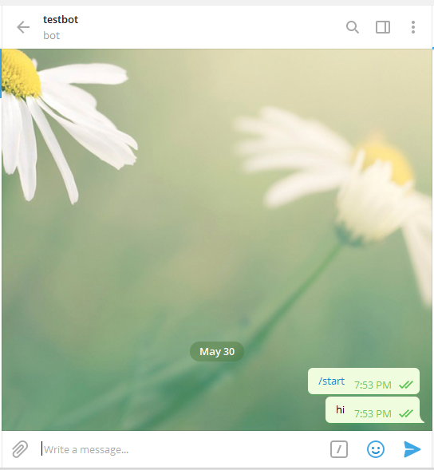

# Notify Me

Get your instant messaging apps to notify you when at key points of your function or when your script has 
finished processing! I use this extensive for code with long processing time.

## Usage
```python
import notifyhub as notifyhub

# send a 'hello' message via telegram
notifyhub.send_message(message='hello', messenger='telegram')

# get notified when your function starts/ends/crashes.
@notifyhub.watch(messenger="telegram")
def main():
    print(1 + 1)
main()
```


## Telegram

### Setup

Search for BotFather in telegram and use the following commands to create the bot. Take note of your bot's token 
(e.g. 1017471971:AAGpJEEFZH9Mlj3_GakRtaKeMK-dmaxQVKE) and set `BOT_TOKEN` in `messengers/telegram.py`


Then, visit `t.me/notifymetestbot` in your browser and send a message to your bot. The first message is needed to get 
your `CHAT_ID`.



Then, visit `https://api.telegram.org/bot<BOT_TOKEN>/getUpdates` e.g. `https://api.telegram.org/bot1017471971:AAGpJEEFZH9Mlj3_GakRtaKeMK-dmaxQVKE/getUpdates` to get your chat id


In this case, our chat id is `375385701`, and replace this value into `CHAT_ID` in `messengers/telegram`. Your bot 
should be ready, to test, run `messengers/telegram.py`.
